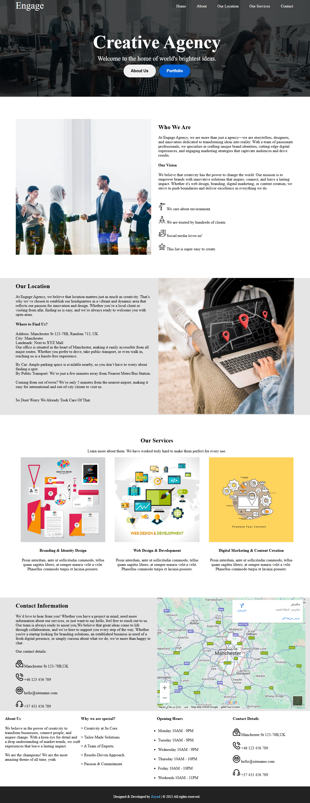

# Practice Apps 🚀

Welcome to the **Practice Apps** repository! This repository contains multiple small projects that I developed while learning and improving my web development skills. Each project is structured independently and focuses on different aspects of front-end technologies.

---

## 📌 Projects Overview

### 🟢 Project -1 [ First HTML ]

**📂 Path:** `Project-1/`  
🔹 **Description:** A basic HTML project with two main pages:

- **Restaurant Table Page:** Displays a table for a pasta restaurant named _Trattoria del Sole_, featuring six pasta dishes. This page is designed to practice creating and styling HTML tables.
- **Form Page:** A form asking for personal information, designed to practice form elements and input validation.  
  🔹 **Technologies Used:** HTML, CSS

🖼️ **Screenshots:**

<table>
  <tr>
    <td></td>
    <td></td>
  </tr>
</table>
---

### 🔵 Project -2 [ Engage ]

**📂 Path:** `Project-2/`  
🔹 **Description:** A single-page website for a creative agency named _Engage_. The project is designed to practice layout techniques, including:

- `display: inline-block` (used in the first two sections)
- `float` (used in sections 3 and 4)
- Proper use of `background`, `padding`, `margin`, and `border` for structured design.

  🔹 **Technologies Used:** HTML, CSS

🖼️ **Screenshots:**

<p align="center">
  
</p>

---

### 🚀 Upcoming Projects

More projects will be added soon! Stay tuned for updates.

---

## 📂 How to Use

1. Clone the repository:
   ```bash
   git clone https://github.com/ZeyadHub/Practice-Apps.git
   ```
2. Navigate to the project directory:
   ```bash
   cd Practice-Apps/Assigment-1  # Example for First HTML project
   ```
3. Open `index.html` in your browser or use a local server to run the project.

---

## 💡 Contributing & Feedback

If you have any suggestions or improvements, feel free to open an issue or contribute to the repository.

---

### ⭐ Feel free to explore and give a star if you like this repository!
